# Job Radar

**Privacy-first job discovery, CV-backed matching and application tracking for Poland.**

Job Radar finds relevant vacancies every weekday, filters out roles that don't fit, ranks the rest against a CV and delivers them to a phone-friendly PWA. The final decision to apply always stays with a human: nothing is sent automatically.

This repository contains the **public PWA** and the **sanitized daily feed** (`data/jobs.json`). The discovery and matching backend (Python, GitHub Actions, regression tests) lives in a **separate private repository**, so that candidate data never becomes public.

---

## How it works

```mermaid
flowchart LR
    A["Job boards<br/>Pracuj.pl · JustJoin.it · No Fluff Jobs"] --> B["Normalize &amp; deduplicate"]
    B --> C["Hard filters<br/>contract · location · seniority · experience"]
    C --> D["CV-backed role &amp; requirements validation"]
    D --> E["Scoring &amp; detail validation"]
    E --> F["Structured summaries &amp;<br/>verified recruitment contacts"]
    F --> G["Privacy-safe export<br/>data/jobs.json"]
    G --> H["PWA on phone"]
    H --> I["Human review &amp; apply"]
    I --> J["Local application tracker"]

    subgraph Private repository
        B
        C
        D
        E
        F
    end
    subgraph This repository
        G
        H
    end
```

## Backend (private repository)

- **Sources:** Pracuj.pl, JustJoin.it and No Fluff Jobs. Sources that block access are reported honestly as unavailable instead of silently returning zero jobs.
- **Hard filters before scoring:** contract type, location and work mode, seniority, explicit years of experience and mandatory technologies or languages. Personal interest can boost a vacancy only after it passes these checks.
- **Title and role relevance first:** generic skill overlap (Excel, reporting, "operations") cannot rescue a vacancy from an unrelated profession.
- **Multilingual parsing** of Polish and English requirements, including Polish experience ranges such as "1–2 lata doświadczenia".
- **Structured summaries:** each card shows *What you'll do*, *What they expect* and *What they offer*. Missing benefits are stated as missing, never invented.
- **Verified contact discovery:** only recruitment or official company mailboxes on a verified company domain. Personal addresses are never guessed.
- **Scheduling:** several lightweight weekday checks on GitHub Actions with Warsaw-time gating, so a delayed cron run still gets another chance and duplicate same-day runs exit early.
- **Regression testing as a gate:** 170+ automated tests run before every scheduled discovery. Real false positives from the production feed are turned into new regression fixtures.

## PWA (this repository)

- Installable, mobile-first app with an offline app shell and a cached last feed
- Filters: Today, Unseen, Apply, Possible, Stretch, Queue, Saved, Applied, Replies
- **Application Tracker:** dates, channel, status, replies, interviews, offers, notes, statistics and JSON backup
- **Reply Matcher:** paste a company name, sender or email fragment to match it against tracked applications, entirely on the device
- **Application Assistant:** Review → Choose CV → Apply → Track, with requirement checks and reusable answers
- **Prepare email:** opens the device mail app with a prepared message to a verified company mailbox; the user attaches a CV and sends it manually

## Privacy model

- The matching profile in the backend is anonymized: no name, phone, email, LinkedIn or CV file.
- The public feed is built from an explicit allowlist. Matching evidence, drafts and raw contact-discovery data are never published.
- Application history and personal application data are stored only in the browser on the user's device.

## Tech stack

Python · GitHub Actions · JavaScript PWA (service worker, web app manifest) · GitHub Pages · Brave Search API as a capped fallback for company discovery

---

Built by [Artem Honcharenko](https://github.com/tyomkaa).
